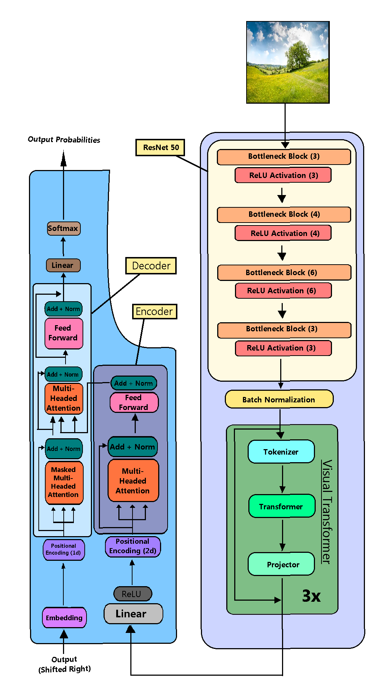

# Visual Transformers Captioning, improving captioning for Blind & Visually Impaired People

This is an independent research project to test the efficacy of Visual Transformers (Wu et al), in combination with a normal transformer, for captioning. The Visual Transformer performs feature extraction. The transformer then uses the extracted features to produce a caption. This research was mainly aimed at assisting people with vision disabilities, which is why I used the VizWiz Image Captioning dataset (https://vizwiz.org/tasks-and-datasets/image-captioning/) to train the language model. The SUN397 dataset was used to train the Visual Transformer (https://vision.princeton.edu/projects/2010/SUN/). 

Visual Transformer paper: https://arxiv.org/abs/2006.03677

Visual Transformer code from: https://github.com/tahmid0007/VisualTransformers

## Visual Diagrams of Model
### Model Overview

### Visual Transformer in Depth 

[source](https://github.com/tahmid0007/VisualTransformers)
